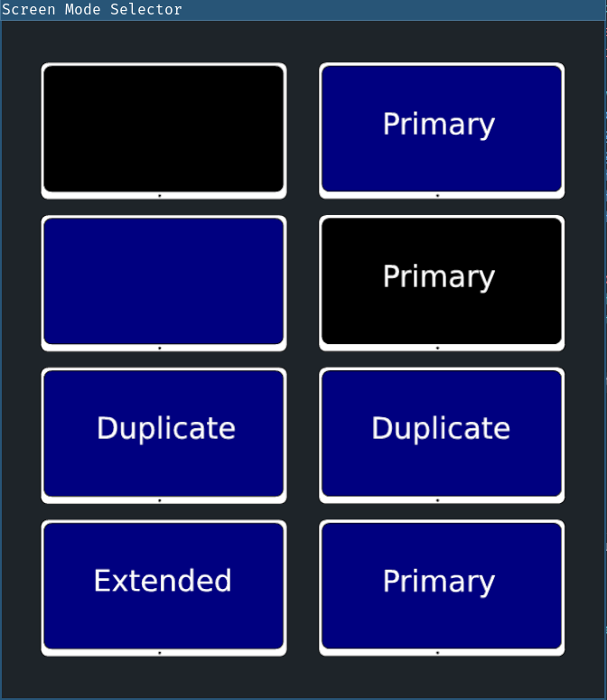

# Screen-Mode-Selector

Easy toggle between modes for two monitors.

Makes changing monitor layout simpler and faster.

Comes in handy when you have to present something or just want to enable your display.

Bind it to a key for optimal handyness.

### Standalone application

Depends on:
[iced]:https://github.com/hecrj/iced
xrandr

Opens a floating window that lets you click on what screen you want active and immediately closes after click/enter,
built entierly in rust, using the [iced GUI library]:https://github.com/hecrj/iced.

TODO:
- Event when no external monitor is connected, enable the connected monitor, and close.
    Comes in handy when primary is disabled after after disconnecting while in "external monitor only" mode.
    xrandr does not automatically switch back to the connected display, so having this would be nice.

- Fix select with keyboard arrows/vim
- Nicer icons

Features:

- Only Primary
- Only Secondary
- True duplicate, highest common resolution)
- Extend (highest available on both monitors)

Future Features:
- Screen position left or right
